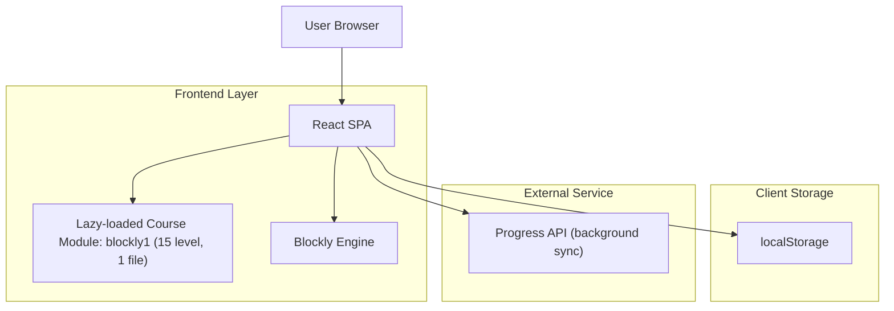

## 1.Architecture design

## 2.Technology Description
- Frontend: React@18 + TypeScript + react-router + Blockly
- Backend: None (memanggil Progress API yang sudah tersedia sebagai external service)

## 3.Route definitions
| Route | Purpose |
|---|---|
| /courses/blockly1 | Halaman course blockly1 (Karel World) 15 level, anti-skip, Run/Reset, Speed x1/x2 |

## 4.API definitions (If it includes backend services)
Tidak ada backend baru di scope ini; frontend hanya melakukan call ke Progress API untuk sinkronisasi progres.

## 6.Data model(if applicable)
Tidak ada database yang didefinisikan untuk scope ini (progres utama disimpan di localStorage, sync ke external Progress API).