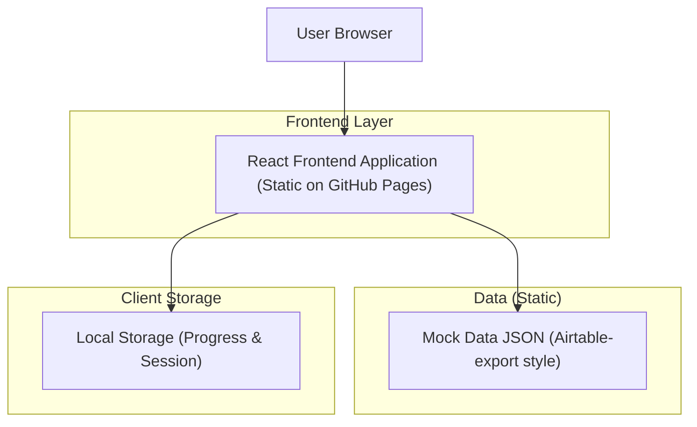
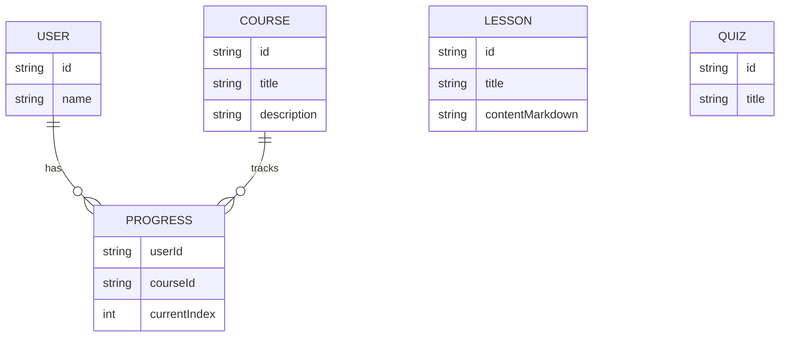

# Arsitektur Teknis — CodeMyni

## 1.Architecture design


## 2.Technology Description
- Frontend: React@18 + TypeScript + vite
- Styling: tailwindcss@3 (atau CSS Modules jika ingin lebih minimal)
- Backend: None (pure static)
- Data: JSON statik di repo (meniru struktur “Airtable export”)

## 3.Route definitions
| Route | Purpose |
|-------|---------|
| / | Gate: membaca query URL, validasi token/role, redirect ke /course |
| /course | Beranda kursus: ringkasan kursus + sequence + tombol lanjutkan |
| /lesson/:lessonId | Halaman materi: render konten dan update progress |
| /quiz/:quizId | Halaman kuis: menjalankan kuis sequence, skor, simpan hasil |
| /admin | Dashboard admin/guru: browser JSON, editor sequence minimal, overview progress |

## 4.API definitions (If it includes backend services)
Tidak ada backend/API. Seluruh data dimuat dari file JSON statik.

Tipe data (dipakai oleh UI):
```ts
export type Role = 'admin' | 'teacher' | 'student';

export type User = {
  id: string;
  name: string;
  roleHint?: Role; // opsional untuk membantu mock
};

export type Course = {
  id: string;
  title: string;
  description: string;
  sequence: SequenceItem[];
};

export type SequenceItem =
  | { type: 'lesson'; lessonId: string; title: string }
  | { type: 'quiz'; quizId: string; title: string };

export type Lesson = {
  id: string;
  title: string;
  contentMarkdown: string;
};

export type Quiz = {
  id: string;
  title: string;
  questions: QuizQuestion[];
};

export type QuizQuestion = {
  id: string;
  prompt: string;
  type: 'single_choice' | 'true_false';
  options: { id: string; text: string; isCorrect: boolean }[];
  explanation?: string;
};

export type StoredSession = {
  role: Role;
  token: string;
  userId?: string; // wajib untuk student
};

export type Progress = {
  userId: string;
  courseId: string;
  currentIndex: number; // index aktif pada course.sequence
  completed: {
    lessons: Record<string, { completedAt: string }>;
    quizzes: Record<string, { score: number; completedAt: string }>;
  };
};
```

## 5.Server architecture diagram (If it includes backend services)
Tidak ada.

## 6.Data model(if applicable)
### 6.1 Data model definition


### 6.2 Data Definition Language
Tidak menggunakan database/DDL. Data mock disimpan sebagai file JSON, misalnya:
- `data/users.json`
- `data/course.json`
- `data/lessons.json`
- `data/quizzes.json`

Catatan keamanan (implikasi requirement):
- Autentikasi via query URL bersifat “mock/insecure”; token hanya untuk gating sederhana di UI.
- Progress disimpan di `localStorage` sehingga tidak sinkron antar perangkat dan mudah dihapus.
