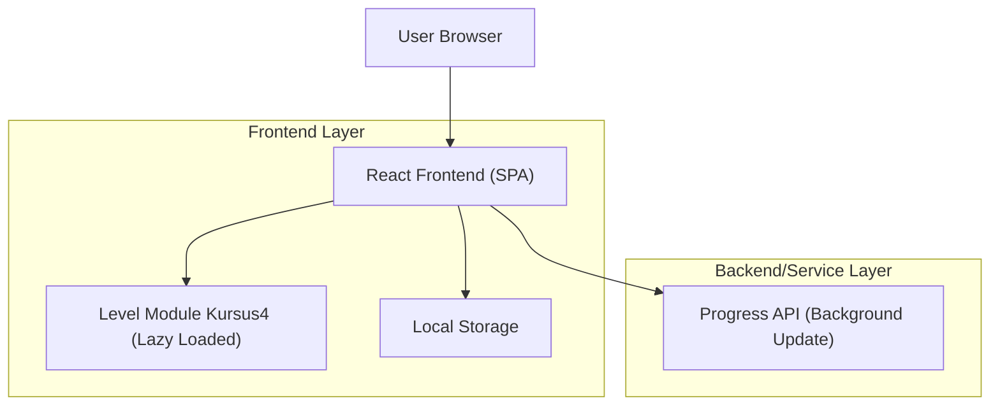

## 1.Architecture design


## 2.Technology Description
- Frontend: React@18 + TypeScript + vite
- Backend: Existing Progress API (dipanggil dari frontend, non-blocking)

## 3.Route definitions
| Route | Purpose |
|---|---|
| /courses | Daftar kursus dan tombol masuk/lanjutkan kursus TinyTank |
| /course/4?lv=1 | Halaman kursus4 TinyTank dengan level ditentukan oleh query `lv` |

## 4.API definitions (If it includes backend services)
### 4.1 Core API
Update progres level (dipanggil setelah level selesai; berjalan di background)
```
POST /api/progress
```

Request:
| Param Name | Param Type | isRequired | Description |
|---|---:|---:|---|
| courseId | string | true | ID kursus ("4") |
| level | number | true | Level yang selesai (1-15) |
| status | "completed" | true | Status penyelesaian |
| clientTime | string | false | ISO timestamp dari client |

Response:
| Param Name | Param Type | Description |
|---|---|---|
| ok | boolean | Berhasil/gagal diproses |

Example
```json
{
  "courseId": "4",
  "level": 3,
  "status": "completed",
  "clientTime": "2026-02-25T10:00:00.000Z"
}
```

## 6.Data model(if applicable)
Tidak menambah model database baru untuk kursus ini; progres utama disimpan di local storage dan hanya disinkronkan lewat Progress API bila tersedia.