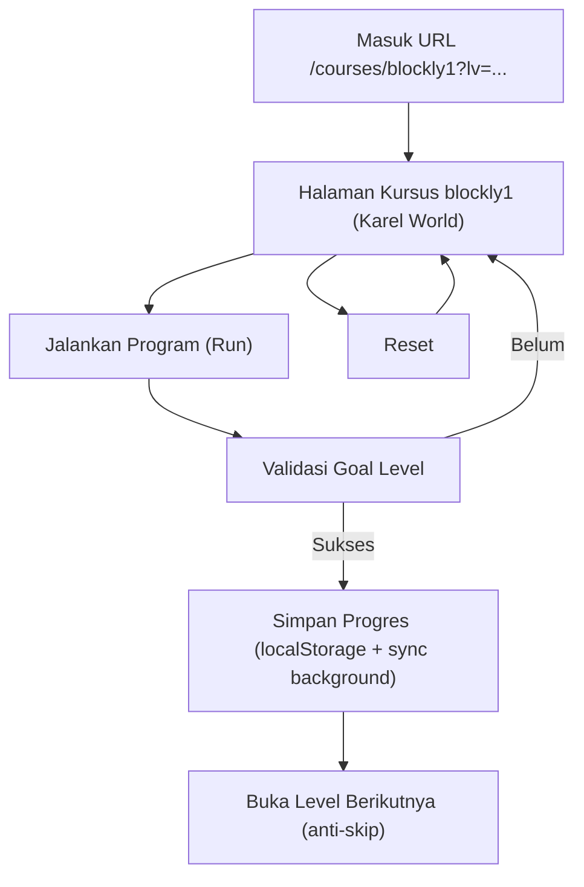

## 1. Product Overview
blockly1 (Karel World) adalah course interaktif 15 level dengan editor Blockly.
Kamu menyelesaikan tantangan Karel per level, progres tersimpan lokal dan disinkronkan ke server di background.

## 2. Core Features

### 2.1 Feature Module
Kebutuhan course ini terdiri dari halaman utama berikut:
1. **Halaman Kursus blockly1 (Karel World)**: navbar level (anti-skip), area kerja Blockly di tengah, panel tantangan+program di kanan, tombol Run/Reset + Speed x1/x2, progres localStorage + sync background, dukungan query `lv`.

### 2.2 Page Details
| Page Name | Module Name | Feature description |
|---|---|---|
| Halaman Kursus blockly1 (Karel World) | Loader course (lazy load) | Memuat definisi 15 level dari 1 file hanya saat kamu masuk halaman course. |
| Halaman Kursus blockly1 (Karel World) | Navbar Level + Anti-skip | Menampilkan level 1–15; mengunci level di atas level aktif; mengizinkan pindah hanya ke level yang sudah terbuka (maks = current/tercapai + 1). |
| Halaman Kursus blockly1 (Karel World) | Query Level (`lv`) | Membaca `?lv=1..15` saat masuk; jika `lv` melewati level yang diizinkan maka otomatis koreksi ke level yang valid; memperbarui URL saat kamu ganti level. |
| Halaman Kursus blockly1 (Karel World) | Area Editor (Blockly) | Menampilkan workspace Blockly di area tengah; menyediakan blok yang relevan untuk level aktif; menyimpan state workspace level aktif (mis. XML) agar tidak hilang saat refresh. |
| Halaman Kursus blockly1 (Karel World) | Panel Tantangan + Program | Menampilkan deskripsi tujuan level (goal) dan petunjuk singkat; menampilkan representasi program/hasil kompilasi dari blok (mis. daftar instruksi) yang merefleksikan workspace saat ini. |
| Halaman Kursus blockly1 (Karel World) | Kontrol Eksekusi | Menjalankan solusi saat klik **Run**; menghentikan/mengembalikan ke kondisi awal saat klik **Reset**; menyediakan toggle **Speed x1/x2** yang memengaruhi kecepatan animasi/step. |
| Halaman Kursus blockly1 (Karel World) | Eksekusi Aman (non-blocking) | Menjalankan step secara asynchronous sehingga UI tetap responsif; mencegah multi-run (mis. disable Run saat berjalan) dan mendukung pembatalan lewat Reset. |
| Halaman Kursus blockly1 (Karel World) | Validasi & Penyelesaian Level | Mengecek apakah goal level tercapai; saat sukses, menandai level selesai, membuka level berikutnya, dan mengunci agar tidak bisa lompat melewati urutan. |
| Halaman Kursus blockly1 (Karel World) | Progres Lokal + Sync Background | Menyimpan progres (level tertinggi selesai, status per level, timestamp) ke `localStorage`; saat level selesai, mengirim update progres ke Progress API di background (tidak memblok UI) dan retry ringan jika gagal. |

## 3. Core Process
**Alur belajar (single user):**
1. Kamu membuka halaman course `blockly1` (opsional dengan `?lv=`).
2. Aplikasi lazy-load konten 15 level dari 1 file, lalu menentukan level yang boleh diakses berdasarkan progres di `localStorage`.
3. Jika `lv` tidak valid / melanggar anti-skip, aplikasi mengarahkan kamu ke level yang valid dan memperbarui query.
4. Kamu menyusun blok di editor (tengah), membaca tujuan & program ringkas di panel kanan.
5. Kamu menekan **Run** untuk mengeksekusi; kamu dapat mengubah **Speed x1/x2**; menekan **Reset** untuk membatalkan dan kembali ke state awal level.
6. Saat goal tercapai, level ditandai selesai, level berikutnya terbuka, progres disimpan ke `localStorage`, dan update dikirim ke Progress API di background.

