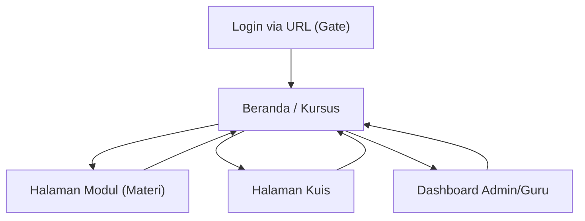

# PRD — CodeMyni (LMS Statik)

## 1. Product Overview
CodeMyni adalah LMS statik (tanpa server) yang bisa di-host di GitHub Pages untuk mengelola 1 kursus dengan urutan materi + kuis. Autentikasi dilakukan via query URL untuk membedakan role admin/guru/murid dan mengakses data mock “Airtable” berbentuk JSON.

## 2. Core Features

### 2.1 User Roles
| Role | Registration Method | Core Permissions |
|------|---------------------|------------------|
| Admin | Membuka URL dengan parameter `?role=admin&token=...` | Mengelola data mock (kursus, modul, kuis, user), melihat semua progress, impersonasi user untuk testing (frontend-only). |
| Teacher (Guru) | Membuka URL dengan parameter `?role=teacher&token=...` | Melihat kursus & hasil kuis murid, mengatur urutan modul/kuis untuk 1 kursus (berbasis JSON). |
| Murid | Membuka URL dengan parameter `?role=student&token=...&userId=...` | Mengikuti urutan materi, mengerjakan kuis, menyimpan progress lokal (per browser). |

### 2.2 Feature Module
Kebutuhan aplikasi terdiri dari halaman utama berikut:
1. **Beranda / Kursus**: ringkasan kursus, tombol lanjutkan, daftar modul dalam urutan (sequence).
2. **Halaman Modul (Materi)**: konten materi, status selesai, navigasi next/prev sesuai urutan.
3. **Halaman Kuis**: pengerjaan kuis per langkah, validasi jawaban, skor, ringkasan hasil, lanjut ke langkah berikutnya.
4. **Dashboard Admin/Guru**: lihat data mock JSON, lihat progress murid, edit ringan sequence kursus (di UI) lalu ekspor JSON.
5. **Login via URL (Gate)**: pembacaan query URL, pemilihan role, penanganan token tidak valid, redirect ke beranda.

### 2.3 Page Details
| Page Name | Module Name | Feature description |
|-----------|-------------|---------------------|
| Login via URL (Gate) | Query parser | Membaca `role`, `token`, dan `userId` (jika murid) dari URL; memvalidasi token secara statik; menyimpan session ke memori (dan opsional `localStorage`). |
| Login via URL (Gate) | Access control | Mengarahkan user ke halaman beranda; menolak akses jika role tidak dikenal/token salah; menampilkan instruksi contoh URL. |
| Beranda / Kursus | Course summary | Menampilkan 1 kursus (judul, deskripsi, estimasi durasi), progress saat ini, dan CTA “Lanjutkan”. |
| Beranda / Kursus | Sequence list | Menampilkan urutan item (materi/kuis) beserta status (locked/available/completed) berdasarkan progress. |
| Halaman Modul (Materi) | Content viewer | Menampilkan konten materi (teks/markdown sederhana), lampiran link (jika ada), dan indikator langkah ke-n pada sequence. |
| Halaman Modul (Materi) | Progress update | Menandai modul selesai; membuka item berikutnya; menyimpan progress per `userId` ke `localStorage`. |
| Halaman Kuis | Quiz runner | Menampilkan pertanyaan sesuai definisi JSON (pilihan ganda/benar-salah), menerima jawaban, dan mengunci submit per soal. |
| Halaman Kuis | Scoring & result | Menghitung skor, menampilkan pembahasan singkat (jika ada), menyimpan hasil dan status “completed” untuk langkah kuis. |
| Dashboard Admin/Guru | Data browser | Menampilkan dataset JSON (users, course, sequence, quiz bank, progress) dalam tampilan tabel/read-only. |
| Dashboard Admin/Guru | Sequence editor (minimal) | Mengubah urutan item sequence untuk 1 kursus (drag/drop atau naik-turun); validasi tipe item; ekspor JSON hasil edit untuk dipakai sebagai mock. |
| Dashboard Admin/Guru | Progress overview | Menampilkan progress per murid (langkah terakhir, skor kuis), filter berdasarkan userId. |

## 3. Core Process
Alur Murid:
1) Murid membuka link yang diberikan (`role=student`) → masuk Beranda. 2) Murid klik “Lanjutkan” → diarahkan ke item sequence aktif (materi atau kuis). 3) Setelah menyelesaikan materi/kuis, progress tersimpan di browser → item berikutnya terbuka → kembali ke Beranda atau lanjut otomatis.

Alur Guru:
1) Guru membuka link (`role=teacher`) → masuk Dashboard. 2) Guru melihat progress murid dan hasil kuis. 3) Jika perlu, guru mengubah urutan sequence kursus → ekspor JSON untuk disebarkan bersama build statik.

Alur Admin:
1) Admin membuka link (`role=admin`) → masuk Dashboard. 2) Admin melihat seluruh dataset mock dan progress. 3) Admin dapat impersonasi user untuk QA (mengganti `userId` di UI) dan memvalidasi alur.

