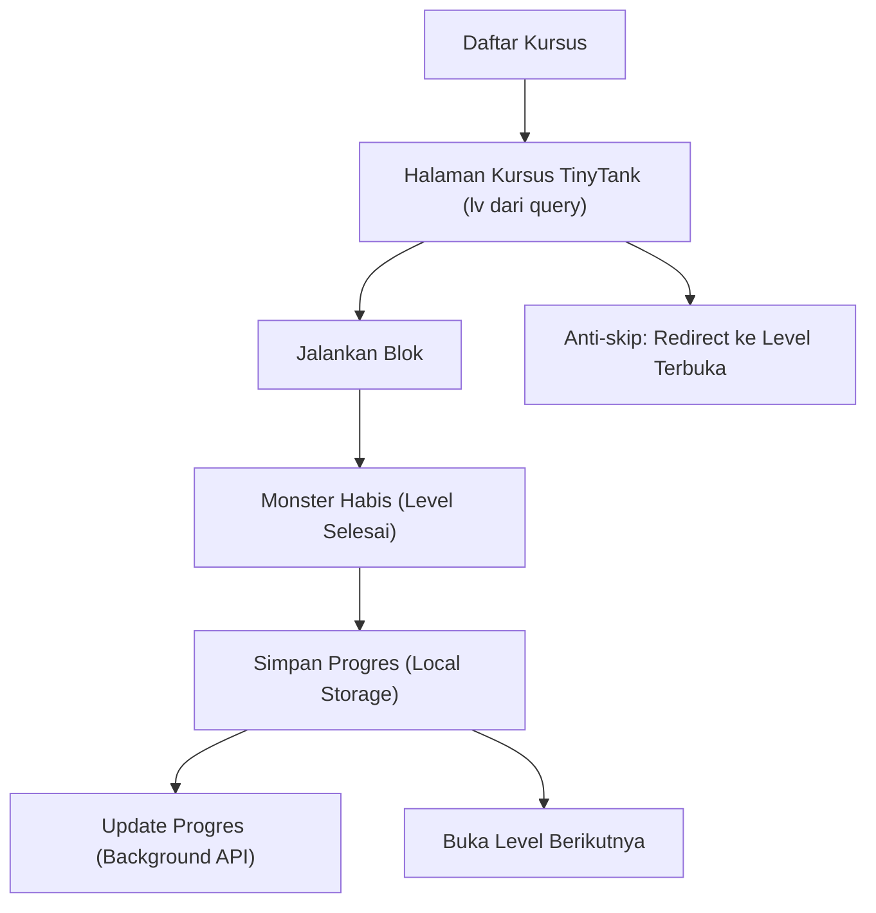

## 1. Product Overview
Kursus4 TinyTank adalah kursus game mini berisi 15 level pemrograman blok untuk mengendalikan tank.
Tujuan tiap level: habiskan semua monster dengan gerakan dan tembakan, sambil menghindari/menyiasati tembok.

## 2. Core Features

### 2.1 Feature Module
Kebutuhan kursus TinyTank terdiri dari halaman utama berikut:
1. **Daftar Kursus**: kartu kursus TinyTank, ringkasan progres, tombol lanjutkan.
2. **Halaman Kursus TinyTank**: pemilihan level via navbar, area game, editor blok (maju/kiri/kanan/tembak), instruksi level, validasi anti-skip.

### 2.3 Page Details
| Page Name | Module Name | Feature description |
|---|---|---|
| Daftar Kursus | Kartu Kursus TinyTank | Menampilkan ringkasan kursus (judul, deskripsi singkat, jumlah level=15) dan tombol masuk kursus. |
| Daftar Kursus | Ringkasan Progres | Menampilkan level terakhir yang terbuka/selesai dari local storage dan tombol “Lanjutkan” menuju level yang diizinkan. |
| Halaman Kursus TinyTank | Router Level (query `lv`) | Membaca query `lv` untuk menentukan level aktif; menulis kembali query saat pengguna berpindah level lewat navbar. |
| Halaman Kursus TinyTank | Anti-skip Level | Memblok akses level jika `lv` > level_terbuka; otomatis mengarahkan ke level_terbuka; menonaktifkan tombol/tautan level yang belum terbuka. |
| Halaman Kursus TinyTank | Data Level (1 file) | Memuat definisi 15 level dalam satu file (layout tembok, posisi monster, posisi pemain, tujuan); memastikan monster tidak terkurung (tidak sepenuhnya tertutup tembok saat awal level). |
| Halaman Kursus TinyTank | Navbar Level (top) | Menampilkan daftar level 1–15 di bagian atas; menandai status (aktif/selesai/terkunci) dan hanya mengizinkan pindah ke level yang sudah terbuka. |
| Halaman Kursus TinyTank | Instruksi & Goal | Menampilkan tujuan “Habiskan monster”, hint singkat “jalur” penyelesaian, dan indikator sisa monster secara real-time. |
| Halaman Kursus TinyTank | Editor Blok | Menyediakan blok: **maju**, **kiri**, **kanan**, **tembak**; menyusun urutan blok dan menghapus/mereset susunan. |
| Halaman Kursus TinyTank | Kontrol Eksekusi Aman | Menjalankan program blok tanpa membekukan UI (non-blocking); menyediakan tombol Jalankan/Hentikan/Reset level. |
| Halaman Kursus TinyTank | Simulasi Game | Menggerakkan tank sesuai blok, menerapkan aturan tabrakan tembok, proyektil tembak, dan eliminasi monster sampai habis. |
| Halaman Kursus TinyTank | Penyelesaian Level & Progres | Saat monster=0, menandai level selesai; menyimpan progres ke local storage; membuka level berikutnya. |
| Halaman Kursus TinyTank | Update Progres (background) | Mengirim update progres ke progress API secara background setelah level selesai; gagal kirim tidak menghapus progres lokal. |

## 3. Core Process
**Alur Pengguna**
1. Kamu membuka Daftar Kursus dan memilih kursus TinyTank (atau klik Lanjutkan).
2. Kamu masuk ke Halaman Kursus TinyTank di level aktif berdasarkan query `lv`.
3. Kamu menyusun blok (maju/kiri/kanan/tembak) lalu menekan Jalankan.
4. Simulasi berjalan; kamu memperbaiki urutan blok sampai semua monster habis.
5. Saat level selesai, progres tersimpan lokal dan level berikutnya terbuka; sistem mengirim update progres ke API di background.
6. Jika kamu mencoba membuka level yang belum terbuka (anti-skip), halaman otomatis mengarahkan kamu ke level yang diizinkan.

